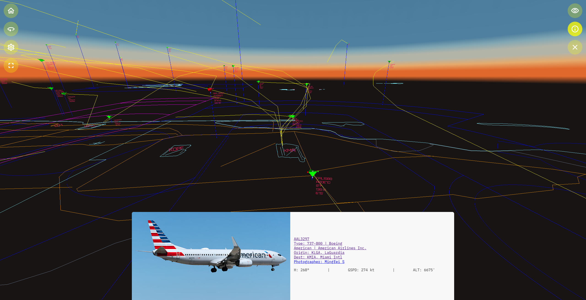

# skies-adsb

_image of the skies-adsb app running in a browser showing air traffic around KMIA in Miami, FL_

# Introduction

skies-adsb is a real-time 3D browser based web app for tracking aircraft using [ADS-B](https://mode-s.org/decode/content/ads-b/1-basics.html) data obtained from a [RTL-SDR](https://www.rtl-sdr.com/about-rtl-sdr/) receiver.

## Features

- aircraft are tracked and rendered in real-time using unfiltered [ADS-B](https://mode-s.org/decode/content/ads-b/1-basics.html) data
- the app is hosted on a [Raspberry Pi](https://www.raspberrypi.org/) running on your local network
- flight status data is provided by the [FlightAware AeroAPI v2](https://flightaware.com/commercial/aeroapi/)
- aircraft photos are provided by [Planespotters.net](https://www.planespotters.net/).
- responsive web app built for touch displays and mobile devices
- supports importing GeoJSON maps of your local area to use as a ground reference plane

_recording of the skies-adsb app running in a browser demonstrating the use of the onscreen controls_

# Installation Guides

Below is an installation guide for setting up skies-adsb on a Raspberry Pi either as a new install or on top of an existing Raspberry Pi installation:

[Raspberry Pi Install Guide](docs/RPI-INSTALL-GUIDE.md)

If you do not have an Raspberry Pi or you wish to use an existing ADS-B decoder already running on a network (or localhost) you can run skies-adsb as a local webapp by following this guide:

[No Raspberry Pi Install Guide / Use Existing Decoder](docs/LOCALHOST-INSTALL-GUIDE.md)

# How to create/update/use skies-adsb GeoJSON maps

[HOWTO GeoJSON Maps](docs/GEOJSON-MAPS.md)

# How to use Cloudflare Tunnel to securely deploy skies-adsb on the Internet

[HOWTO Cloudflare Tunnel](docs/CLOUDFLARE-TUNNEL.md)

# Flask API Server Documentation

[Flask API Server Docs](flask/README.md)

# Development

The app is written using WebGL+HTML5+CSS+JavaScript and it works on all of the latest major browsers: Chrome (Desktop+Mobile), Firefox (Desktop), and Safari (Desktop+Mobile). For information on how to setup a development environment for skies-adsb see here:

[HOWTO Development](docs/DEVELOPMENT.md)

# Contributing

Community GeoJSON maps are welcome. Please submit new maps via a pull-request.

Please report bugs via the issue tracker.

Please submit any feature requests via the issue tracker.

# Thanks

I would like to give special thanks to the following people who gave me valuable feedback and helped me debug the app:

Andre Thais CFI

[Frank E. Hernandez](https://github.com/CodeMinion)

## Fallback Aircraft Photo Attribution

**Pan Am Boeing 747-121 N732PA**

https://commons.wikimedia.org/wiki/File:Pan_Am_Boeing_747-121_N732PA_Bidini.jpg

_by Aldo Bidini_

# References

https://mode-s.org/decode/index.html

https://www.rtl-sdr.com/rtl-sdr-quick-start-guide/

https://www.raspberrypi.com/documentation/

https://www.adsbexchange.com/how-to-feed/

https://flightaware.com/commercial/aeroapi/documentation2.rvt
