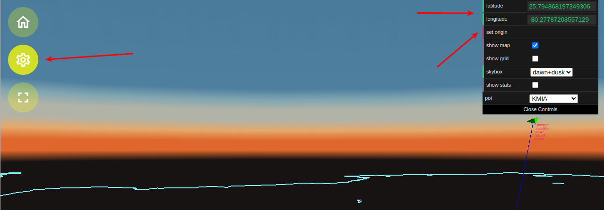

# GeoJSON Maps - How To Create/Update/Use

## Default GeoJSON Map

The skies-adsb web app comes with a hand crafted GeoJSON map of the South Florida (SOFLA) region of the United States.

The GeoJSON map is located at:

```

skies-adsb/geojson/sofla.json

```

## Creating GeoJSON Map For Your Geolocation

The skies-adsb app can display any user generated 2D GeoJSON map to the user in order to aid the visualization of boundaries and of points of interest in order to enhance the plane spotting experience.

The sofla.json map included with skies-adsb was created using this web app:

http://geojson.io/

If you prefer using a native app I suggest using QGIS:

https://qgis.org/

Once you create your GeoJSON map place a copy in the directory:

```

skies-adsb/geojson

```

and then update the OPTIONAL_GEOJSON_MAP variable in the .env file to point to this map.

NOTE: you must rebuild and re-deploy the skies-adsb web app anytime you make changes to the map. See [Install Guide - Step 8](INSTALL-GUIDE.md#step-8---build-and-deploy-the-skies-adsb-web-app-to-the-raspberry-pi).

## Supported GeoJSON Geometry

Only two types of GeoJSON Geometry Objects are supported:

```

Point

and

Polygon

```

## Point

Point is used to display Points-Of-Interest (POI). POI are labeled using an custom "id" property. This can be input via the geojson.io editor. See the data/sofla.json map for
reference. An additional property called "origin" can also be specified to indicate that the point should be used as the origin for the scene.

### Custom Point Feature Properties:

```

"id": "<SOME STRING LABEL>"
"origin": true

```

Example Custom Point for KMIA Aerodrome with KMIA set to the origin for the map:

```
    {
      "type": "Feature",
      "properties": {
        "marker-color": "#7e7e7e",
        "marker-size": "medium",
        "marker-symbol": "",
        "id": "KMIA",
        "origin": "true"
      },
      "geometry": {
        "type": "Point",
        "coordinates": [
          -80.27787208557129,
          25.794868197349306
        ]
      }
    },

```

## Polygon

Only convex 2D Polygons are supported. All Polygons are drawn using wireframe graphics on the XZ plane.

# Default Reference Grid and Default Origin Explained

A default reference grid is displayed if there is no map specified in the .env file.


The GeoJSON map is optional but it does make the aircraft watching experience more interesting and meaningful.

If no map (or map with an origin) is given then the default origin lat/long value given in the .env file is used.

If the default values are not found in the .env file or via a loaded GeoJSON map then the default origin lat/long is:

```

Latitude: 0
Longitude: 0

```

these coordinates are known as [Null Island](https://en.wikipedia.org/wiki/Null_Island)

### Manually Updating the Default Origin

A temporary default origin can be manually entered from the skies-adsb web app by clicking on the gears icon on the left hand side of the screen and then entering valid lat/long values in the settings text fields that is displayed. Once entered press the "set origin" button to set and enable the origin for the scene.


