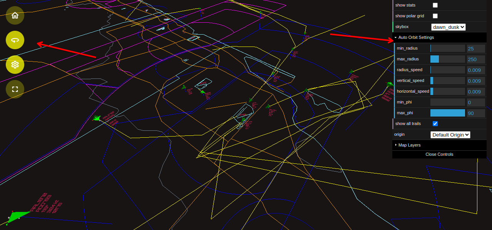
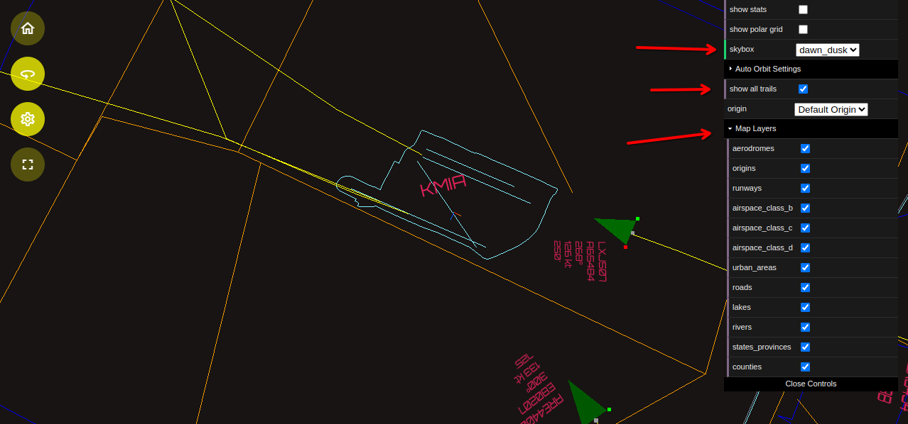

# Introduction

This guide provides step-by-step instructions for installing skies-adsb. The instructions outlined here apply to both:

- New Raspberry Pi installations running 64-bit OS
- Localhost or headless installations on existing systems

Follow each step carefully to set up the core dependencies and configuration needed to deploy and run the application.

# Table of Contents

- [Introduction](#introduction)
- [Prerequisites](#prerequisites)
  - [Important Notes](#important-notes)
  - [Required Software](#required-software)
  - [Development Environment](#development-environment)
- [Step 1 - Clone the skies-adsb repository](#step-1---clone-the-skies-adsb-repository)
- [Step 2 - Setup Python environment](#step-2---setup-python-environment)
- [Step 3 - Install Node.js and npm](#step-3---install-nodejs-and-npm)
- [Step 4 - Initialize the Node.js Dependencies](#step-4---initialize-the-nodejs-dependencies)
- [Step 5 - Create src/.env File](#step-5---create-srcenv-file)
- [Step 6 - Setup Flask Server](#step-6---setup-flask-server)
- [Step 7 - Set Your Geolocation Coordinates](#step-7---set-your-geolocation-coordinates)
- [Step 8 - Download Natural Earth Datasets](#step-8---download-natural-earth-datasets)
- [Step 9 - Download FAA Airspace Shapefile](#step-9---download-faa-airspace-shapefile)
- [Step 10 - Extract the Datasets](#step-10---extract-the-datasets)
- [Step 11 - Build your map layers](#step-11---build-your-map-layers)
- [Step 12 - Configure Visualization Settings](#step-12---configure-visualization-settings)
- [Step 13 - Configure Auto Orbit Environment Variables](#step-13---configure-auto-orbit-environment-variables)
- [Step 14 - Configure Default SkyBox, Aircraft Trails, and Which Map Layers Are Visible by Default](#step-14---configure-default-skybox-aircraft-trails-and-which-map-layers-are-visible-by-default)
- [Next Steps](#next-steps)

# Prerequisites

## Important Notes

- Unix command line experience is required to build and deploy skies-adsb
- Follow all installation steps in sequence unless explicitly noted as optional
- Installation process has been streamlined but requires careful attention to detail

## Required Software

- Git
- Python 3.x or higher
- QGIS (for map working with map layers)
- VSCode recommended for Python/JavaScript development
- Modern web browser with WebGL support (Chrome/Firefox recommended)

## Development Environment

Recommended workstation requirements:

- Operating System: Linux (Ubuntu/Fedora) or macOS
- Storage: 5GB free disk space
- Memory: 8GB RAM minimum
- CPU: Quad-core processor

Note: Development and testing was done on Ubuntu and Fedora workstations

# Step 1 - Clone the skies-adsb repository

On your workstation clone the skies-adsb GitHub repository:

```shell
cd /path/to/your/git/projects
git clone https://github.com/machineinteractive/skies-adsb.git
```

# Step 2 - Setup Python environment

This step setups up a Python Virtual Environment with all the dependencies needed to run the Python scripts included with the app.

```shell
cd /path/to/skies-adsb
python3 -m venv .venv
source .venv/bin/activate
pip3 install flask flask-cors geopandas osmtogeojson requests websockify
deactivate
```

# Step 3 - Install Node.js and npm

The skies-adsb web app requires Node.js and npm. If you already have these installed, you can skip to Step 7.

For a clean Node.js installation, use nvm (Node Version Manager) - the recommended way to install and manage Node.js:

1. Install nvm by following the official instructions at:

https://github.com/nvm-sh/nvm

2. Once nvm is installed, install the latest Node.js version:

```shell
nvm install node
```

3. Logout and login again before continuing to Step 4

# Step 4 - Initialize the Node.js Dependencies

Install required node modules by running:

```shell
cd /path/to/skies-adsb
npm install
```

This will install all dependencies specified in package.json.

# Step 5 - Create src/.env File

The src/.env file is used to store numerous environment variables which are necessary for building and running skies-adsb.

```shell
cd /path/to/skies-adsb
cp docs/dot-env-template src/.env
```

# Step 6 - Setup Flask Server

The Flask server acts as a proxy for aviation-related APIs to fetch realtime aircraft and weather information.

Create the Flask server configuration file:

```shell
cd /path/to/skies-adsb
cp docs/flask-config-template.json flask/config.json
```

This creates the minimum necessary config.json for the Flask server.

For additional functionality like FlightAware AeroAPI integration to get flight status information, see the instructions in the [Flask README](/flask/README.md).

**Note:** Use of the FlightAware AeroAPI is optional (paid service):

- It is required for flight status information
- It is not needed for basic ADS-B data visualization

# Step 7 - Set Your Geolocation Coordinates

The skies-adsb app uses geolocation coordinates as a reference point for:

- Map layer rendering
- Aircraft position tracking relative to your ADS-B receiver
- Distance and bearing calculations

The app does not automatically detect location. You must set these coordinates manually.

To get your coordinates:

1. Visit [OpenStreetMap](https://www.openstreetmap.org/)
2. Search for your location
3. Right-click on your exact position
4. Select "Show address"
5. Note the latitude and longitude values

Add these coordinates to your **/path/to/skies-adsb/src/.env** file:

```shell
SKIES_ADSB_DEFAULT_ORIGIN_LATITUDE=<DEFAULT ORIGIN LATITUDE>
SKIES_ADSB_DEFAULT_ORIGIN_LONGITUDE=<DEFAULT ORIGIN LONGITUDE>
```

Example using Miami International Airport (KMIA):

```shell
SKIES_ADSB_DEFAULT_ORIGIN_LATITUDE=25.7955406
SKIES_ADSB_DEFAULT_ORIGIN_LONGITUDE=-80.2918816
```

# Step 8 - Download Natural Earth Datasets

skies-adsb uses Natural Earth datasets and FAA Airspace Shapefiles for building map layers. Due to GitHub file size limitations, you must download and install these data files separately by following the steps below.

## 1:10m Scale Datasets

From https://www.naturalearthdata.com/downloads/10m-cultural-vectors/

- Click "Download all 10m cultural themes"

From https://www.naturalearthdata.com/downloads/10m-physical-vectors/

- Click "Download all 10m physical themes"

## 1:110m Scale Datasets

From https://www.naturalearthdata.com/downloads/110m-cultural-vectors/

- Click "Download all 110m cultural themes"

From https://www.naturalearthdata.com/downloads/110m-physical-vectors/

- Click "Download all 110m physical themes"

Copy the files:

- **10m_cultural.zip**
- **10m_physical.zip**
- **110m_cultural.zip**
- **110m_physical.zip**

to the directory:

```shell
/path/to/skies-adsb/maps/data
```

# Step 9 - Download FAA Airspace Shapefile

Download the FAA Airspace Shapefile:

1. Go to [FAA Airspace Data](https://adds-faa.opendata.arcgis.com/datasets/faa::class-airspace)
2. Click "Download"
3. Choose "Shapefile" format

Save the downloaded **Class_Airspace.zip** file.

Copy the **Class_Airspace.zip** file to:

```shell
/path/to/skies-adsb/maps/data
```

# Step 10 - Extract the Datasets

The install-datasets.sh script will extract the Natural Earth and FAA Airspace datasets to their required locations for use by the build-map-layers.py script.

```shell
cd /path/to/skies-adsb/maps/data
./install-datasets.sh
```

# Step 11 - Build your map layers

This step is necessary to build map layers specific to your ADS-B installation location. Without map layers, you'll only see a skybox and aircraft. If you prefer not to use map layers, the simulation includes a reference polar grid that can be toggled on/off via the settings GUI.

```shell
cd /path/to/skies-adsb
cd maps
chmod +x build_map_layers.sh
./build-map-layers.sh
```

for more information see this document:

[Build Map Layers Guide](BUILD-MAPS.md)


_Examples of custom map layers: Miami International (KMIA), LaGuardia (KLGA), and Mexico City International (MMMX) airports_


_Reference Polar Grid_

## Test your map layers

At this point you can see what your map layers look like by running the following command:

```shell
cd /path/to/skies-adsb
npx vite --host
```

This will launch the Vite development HTTP server.

# Step 12 - Configure Visualization Settings

The following table lists the default visualization settings in **src/utils.js**. These settings control various aspects of the 3D visualization including camera behavior, skybox dimensions, and aircraft tracking parameters.

<!-- prettier-ignore -->
| Constant                        | Default Value | Description                                            |
| ------------------------------- | ------------- | ------------------------------------------------------ |
| DEFAULT_SCALE                   | 1.0 / 250.0   | Default scale for geometry                             |
| CAMERA_FOV                      | 75            | Camera field of view in degrees                        |
| CAMERA_NEAR                     | 0.1           | Camera Near clipping plane distance                    |
| CAMERA_FAR                      | 10000.0       | Camera Far clipping plane distance                     |
| SKYBOX_RADIUS                   | 3000.0        | Radius of the skybox (must be ≤ half of CAMERA_FAR)    |
| FOLLOW_CAM_DISTANCE             | 24.0          | Default follow camera distance from aircraft           |
| POLAR_GRID_RADIUS               | 3000.0        | Radius of the polar grid (should match SKYBOX_RADIUS)  |
| POLAR_GRID_RADIALS              | 16            | Number of radial lines in the polar grid               |
| POLAR_GRID_CIRCLES              | 5             | Number of concentric circles in the polar grid         |
| POLAR_DIVISIONS                 | 64            | Number of divisions in the polar grid                  |
| POLAR_GRID_COLOR_1              | "#81efff"     | Primary color for polar grid                           |
| POLAR_GRID_COLOR_2              | "#81efff"     | Secondary color for polar grid                         |
| AIRCRAFT_TTL                    | 15.0          | Aircraft time-to-live in seconds                       |
| AIRCRAFT_TRAIL_UPDATE_FREQUENCY | 75            | Trail update frequency based on telemetry update count |
| AIRCRAFT_MAX_TRAIL_POINTS       | 5000          | Maximum number of points in aircraft trail             |

These values can be modified in the **src/util.js** file to adjust the visualization behavior to your preferences. Note that some values are interdependent (e.g., SKYBOX_RADIUS must be less than or equal to half of CAMERA_FAR).

# Step 13 - Configure Auto Orbit Environment Variables

The following variables in src/.env control the default automatic camera orbit behavior on app launch:

<!-- prettier-ignore -->
| Variable Name | Explanation | Value | Default |
| ------------- | ----------- | ------| ------- |
| SKIES_ADSB_DEFAULT_CAMERA_MODE                  | Initial camera mode at startup                 | string(ORBIT, or AUTO_ORBIT) | ORBIT   |
| SKIES_ADSB_SETTINGS_AUTO_ORBIT_MIN_RADIUS       | Minimum orbit radius in world units            | Number >= 0                  | 25      |
| SKIES_ADSB_SETTINGS_AUTO_ORBIT_MAX_RADIUS       | Maximum orbit radius in world units            | Number >= MIN_RADIUS         | 250     |
| SKIES_ADSB_SETTINGS_AUTO_ORBIT_RADIUS_SPEED     | Speed of radius changes                        | Number between 0-0.5         | 0.009   |
| SKIES_ADSB_SETTINGS_AUTO_ORBIT_VERTICAL_SPEED   | Speed of vertical movement                     | Number between 0.001-0.1     | 0.009   |
| SKIES_ADSB_SETTINGS_AUTO_ORBIT_HORIZONTAL_SPEED | Speed of horizontal rotation                   | Number between 0.001-0.1     | 0.009   |
| SKIES_ADSB_SETTINGS_AUTO_ORBIT_MIN_PHI          | Minimum camera phi angle (degrees from zenith) | Number >= 0                  | 0       |
| SKIES_ADSB_SETTINGS_AUTO_ORBIT_MAX_PHI          | Maximum camera phi angle (degrees from zenith) | Number >= MIN_ALTITUDE       | 90      |



_Auto Orbit Camera Controls_

# Step 14 - Configure Default SkyBox, Aircraft Trails, and Which Map Layers Are Visible by Default

<!-- prettier-ignore -->
| Variable Name | Explanation | Value | Default |
|---------------|-------------|-------|---------|
| SKIES_ADSB_SETTINGS_DEFAULT_SKYBOX        | Set Default Skybox Theme                                       | string (DAWN_DUSK, DAY, or NIGHT) | DAWN_DUSK |
| SKIES_ADSB_SETTINGS_SHOW_ALL_TRAILS       | Controls visibility of aircraft trails for all tracked flights | boolean                           | true      |
| SKIES_ADSB_SETTINGS_SHOW_AERODROMES       | Controls visibility of aerodrome and runways locations         | boolean                           | true      |
| SKIES_ADSB_SETTINGS_SHOW_ORIGINS          | Controls display of origin name labels                         | boolean                           | true      |
| SKIES_ADSB_SETTINGS_SHOW_AIRSPACE_CLASS_B | Controls visibility of Class B airspace boundaries             | boolean                           | true      |
| SKIES_ADSB_SETTINGS_SHOW_AIRSPACE_CLASS_C | Controls visibility of Class C airspace boundaries             | boolean                           | true      |
| SKIES_ADSB_SETTINGS_SHOW_AIRSPACE_CLASS_D | Controls visibility of Class D airspace boundaries             | boolean                           | true      |
| SKIES_ADSB_SETTINGS_SHOW_URBAN_AREAS      | Controls display of urban area boundaries                      | boolean                           | true      |
| SKIES_ADSB_SETTINGS_SHOW_ROADS            | Controls visibility of major roads and highways                | boolean                           | true      |
| SKIES_ADSB_SETTINGS_SHOW_LAKES            | Controls visibility of lakes and large water bodies            | boolean                           | true      |
| SKIES_ADSB_SETTINGS_SHOW_RIVERS           | Controls visibility of rivers and waterways                    | boolean                           | true      |
| SKIES_ADSB_SETTINGS_SHOW_STATES_PROVINCES | Controls display of state/province boundaries                  | boolean                           | true      |
| SKIES_ADSB_SETTINGS_SHOW_COUNTIES         | Controls visibility of county boundaries                       | boolean                           | true      |



_Map Layers Controls_

# Next Steps

After completing the base installation, follow one of these guides to finalize your setup:

- [Raspberry Pi Installation Guide](RPI-INSTALL-GUIDE.md) - Configure skies-adsb on a 64-bit Raspberry Pi ADS-B receiver
- [Localhost+Headless Setup Guide](LOCALHOST-HEADLESS-SETUP-GUIDE.md) - Run skies-adsb locally or headless on your system

Choose the guide that matches your deployment scenario.
