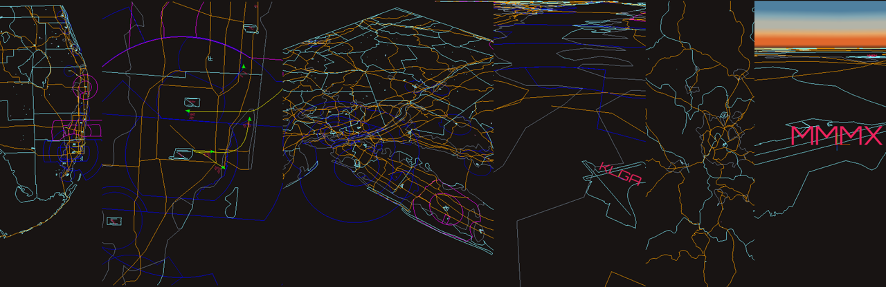
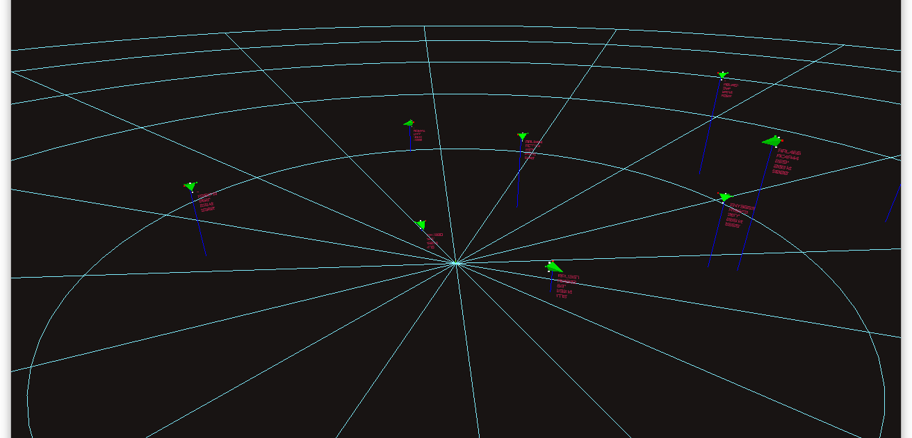

# localhost Setup Guide

This guide describes how to set up skies-adsb locally to connect with an existing ADS-B receiver. The setup:

- Runs as a web app and Flask server on your localhost
- Creates a websocket proxy to forward ADS-B data to localhost:30006
- Works with any ADS-B receiver that outputs [SBS-1 BaseStation data](http://woodair.net/sbs/article/barebones42_socket_data.htm)
- Doesn't modify your existing ADS-B receiver installation

**Note:** skies-adsb was developed under Linux. This document assumes your workstation is running Linux or macOS.

## Table of Contents

- [Step 1 - Prerequisites](#step-1---prerequisites)
- [Step 2 - Setup Environment VITE_USE_EXISTING_ADSB Variable](#step-2---setup-environment-vite_use_existing_adsb-variable)
  - [Example .env file](#example-env-file)
  - [Enable Flight Status](#enable-flight-status)
- [Step 3 - Build your map layers](#step-3---build-your-map-layers)
  - [Test your map layers](#test-your-map-layers)
- [Step 4 - Start skies-adsb](#step-4---start-skies-adsb)

# Step 1 - Prerequisites

This guide assumes that you have set up your local environment as described here:

[INSTALL.md](INSTALL.md)

Please follow the steps in the install guide above before continuing.

# Step 2 - Setup Environment VITE_USE_EXISTING_ADSB Variable

```shell
cd /path/to/skies-adsb/src
```

add the following variables to the **.env** file:

```shell
VITE_USE_EXISTING_ADSB=<ADS-B RECEIVER IP ADDRESS>:<ADS-B RECEIVER SBS-1 PORT>
```

## Example .env file

### NOTE: When VITE_USE_EXISTING_ADSB is defined, skies-adsb defaults to using localhost for both websocket and flask connections.

Example **.env** file with default origin centered on **KMIA** and ADS-B receiver at **192.168.1.123:30003**:

```shell
VITE_DEFAULT_ORIGIN_LATITUDE=25.7955406
VITE_DEFAULT_ORIGIN_LONGITUDE=-80.2918816

VITE_USE_EXISTING_ADSB=192.168.1.123:30003
```

Example **.env** file with default origin centered on **KMIA** and ADS-B receiver at **localhost:30003**:

```shell
VITE_DEFAULT_ORIGIN_LATITUDE=25.7955406
VITE_DEFAULT_ORIGIN_LONGITUDE=-80.2918816

VITE_USE_EXISTING_ADSB=localhost:30003
```

## Enable Flight Status

If you wish to enable flight status with FlightAware AeroAPI then please follow the **OPTIONAL** section in the Flask Server setup instructions here:

[flask/README.md](/flask/README.md)

**note: skip the last part called "Run the Flask Server".\***

# Step 3 - Build your map layers

This step is necessary to build map layers specific to your ADS-B installation location. Without map layers, you'll only see a skybox and aircraft. If you prefer not to use map layers, the simulation includes a reference polar grid that can be toggled on/off via the settings GUI.

```shell
cd /path/to/skies-adsb
cd maps
chmod +x build-map-layers.sh
./build-map-layers.sh
```

for more information see this document:

[Build Map Layers Guide](BUILD-MAPS.md)


_Examples of custom map layers: Miami International (KMIA), LaGuardia (KLGA), and Mexico City International (MMMX) airports_


_Reference Polar Grid_

## Test your map layers

At this point you can see what your map layers look like by running the following command:

```shell
cd /path/to/skies-adsb
npx vite --open
```

This will launch the Vite development HTTP server and launch a web browser.

# Step 4 - Start skies-adsb

```shell
cd /path/to/skies-adsb
./use_existing_adsb.sh
```

**NOTE: To exit press CTRL+C.**

The script will:

- Start the web app in development mode on localhost:5173
- Start the Flask app in development mode on localhost:5000
- Create a websocket proxy at localhost:30006 to forward ADS-B data from your receiver
- Launch your default browser automatically

Once running, you should see live aircraft traffic in your local area.
