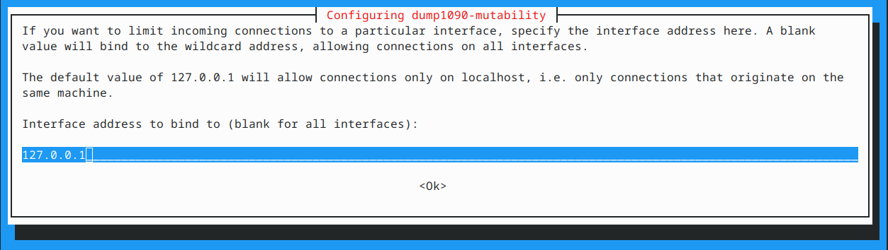
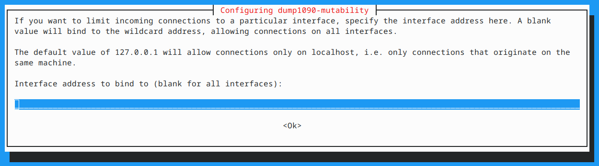

# Introduction

This document describes how to setup and deploy the skies-adsb app to a Raspberry Pi Zero 2 W (or newer 64-bit Raspberry Pi model) connected to a RTL-SDR receiver on your home network.

**Note:** if you have an existing RPI ADS-B installation this guide will make changes to the RPI setup. If you do not wish to alter your RPI setup then please use the [localhost Setup Guide](LOCALHOST-SETUP-GUIDE.md) instead.

**Note:** skies-adsb was developed under Linux. This document assumes your workstation is running Linux or macOS.

## Table of Contents

- [Introduction](#introduction)
- [Terms Used](#terms-used)
- [What You Will Need & Shopping List](#what-you-will-need--shopping-list)
- [Hardware and reference materials used to build this project](#hardware-and-reference-materials-used-to-build-this-project)
  - [Recommended Hardware](#recommended-hardware)
  - [Other hardware used](#other-hardware-used)
  - [Learning about RTL-SDR and ADS-B](#learning-about-rtl-sdr-and-ads-b)
- [Step 1 - Prerequisites](#step-1---prerequisites)
- [Step 2 - Raspberry Pi (RPI) Setup](#step-2---raspberry-pi-rpi-setup)
- [Step 3 - Setup src/.env file variables](#step-3---setup-srcenv-file-variables)
- [Step 4 - OPTIONAL: Use Existing ADS-B receiver / Customize RPI install.sh Script](#step-4---optional-use-existing-ads-b-receiver--customize-rpi-installsh-script)
- [Step 5 - Deploy and run the RPI skies-adsb setup.sh Script](#step-5---deploy-and-run-the-rpi-skies-adsb-setupsh-script)
- [Step 6 - Install the RTL-SDR receiver](#step-6---install-the-rtl-sdr-receiver)
- [Step 7 - Build and Deploy the skies-adsb web app to the Raspberry Pi](#step-7---build-and-deploy-the-skies-adsb-web-app-to-the-raspberry-pi)
- [Step 8 - Test the skies-adsb Installation](#step-8---test-the-skies-adsb-installation)

## Terms Used

<!-- prettier-ignore -->
| Term | Meaning |
|------|---------|
| RPI | Raspberry Pi |
| Default RPI Username | pi |
| Default RPI Hostname | raspberrypi.local |
| Default RPI IP Address | 192.168.1.123 |

## What You Will Need & Shopping List

The minimum hardware needed to build this project is:

- 1 Raspberry Pi Zero 2 W or newer 64-bit Raspberry Pi model
- 1 32gb microSD card
- 1 RTL-SDR Receiver that works with [dump1090-mutability](https://github.com/adsb-related-code/dump1090-mutability)
- 1 ADS-B 1090MHz Antenna (see recommendations below)
- a Linux or Mac workstation for Raspberry Pi setup

**NOTE:** _If you wish to keep the costs as low as possible (and get the best reception), then I suggest using a Raspberry Pi Zero 2 W kit combined with the ADSBexchange.com Blue R820T2 RTL2832U kit._

## Hardware and reference materials used to build this project

### Recommended Hardware

<!-- prettier-ignore -->
| Amount | Item |
|--------|------|
| 1 | [CanaKit Raspberry Pi Zero 2 W - Pi Zero 2 W Starter MAX Kit](https://www.canakit.com/raspberry-pi-zero-2-w.html) |
| 1 | [ADSBexchange.com Blue R820T2 RTL2832U, 0.5 PPM TCXO ADS-B SDR w/Amp and 1090 Mhz Filter, Antenna & Software on Industrial MicroSD](https://store.adsbexchange.com/) |
| 1 | [AirNav RadarBox ADS-B 1090 MHz XBoost Antenna with SMA Connector](https://www.radarbox.com/store) |
| 1 | [Proxicast 6 ft Ultra Flexible SMA Male - SMA Male Low Loss Coax Jumper Cable for 3G/4G/LTE/Ham/ADS-B/GPS/RF Radios & Antennas (Not for TV or WiFi) - 50 Ohm](https://amazon.com/gp/product/B07R2CWDPJ/) |
| 1 | [6ft Tripod](https://amazon.com/gp/product/B005I2YL7I/) |

### Other hardware used

<!-- prettier-ignore -->
| Amount | Item |
|--------|------|
| 1 | [CanaKit Raspberry Pi 3 - Complete Starter Kit - 32 GB Edition](https://www.canakit.com/raspberry-pi-3-starter-kit.html)
| 1 | [RTL-SDR Blog V4 R828D RTL2832U 1PPM TCXO SMA Software Defined Radio with Dipole Antenna Kit](https://www.rtl-sdr.com/buy-rtl-sdr-dvb-t-dongles/) |
| 1 | [Software Defined Radio Receiver USB Stick - RTL2832 w/R820T](https://www.adafruit.com/product/1497) |
| 1 | [Nooelec NESDR Smart v4 Bundle - Premium RTL-SDR w/Aluminum Enclosure, 0.5PPM TCXO, SMA Input & 3 Antennas. RTL2832U & R820T2-Based Software Defined Radio](https://www.nooelec.com/store/nesdr-smart.html) |

### Learning about RTL-SDR and ADS-B

| Amount | Item                                                                                                                           |
| ------ | ------------------------------------------------------------------------------------------------------------------------------ |
| 1      | [The Hobbyist's Guide to the RTL-SDR: Really Cheap Software Defined Radio](https://amazon.com/gp/product/B00KCDF1QI/)          |
| 1      | [RTL-SDR for Everyone: Second Edition 2016 Guide including Raspberry Pi 2](https://amazon.com/gp/product/B01C9KZKAI/)          |
| 1      | [Airband Radio on the RTL-SDR: Tips and tricks for capturing voice and data on a revolutionary device](https://a.co/d/3EMAZcR) |

## Step 1 - Prerequisites

This guide assumes that you have set up your local environment as described here:

[INSTALL.md](INSTALL.md)

Please follow the steps in the install guide above before continuing.

## Step 2 - Raspberry Pi (RPI) Setup

Follow the RPI OS installation instructions here:

https://www.raspberrypi.com/documentation/computers/getting-started.html#installing-the-operating-system

**NOTE: THE SETUP INSTRUCTIONS WILL ASSUME YOU ARE USING THE RASPBERRY PI IMAGER**

I strongly suggest using the [RPI Imager](https://www.raspberrypi.com/software/) to do the initial installation as this will save you time with the initial setup.

You must use the 64-bit version of Raspberry Pi OS. I recommend using Raspberry Pi OS Lite as no GUI is needed.

For this project I am using:

- Raspberry Pi Zero 2 W
- Raspberry Pi 3

Both are running Raspberry Pi OS Lite (64-bit)

NOTE: For purposes of the setup tutorial I'm assuming the default RPI username and hostname are used:

```
username: pi
hostname: raspberrypi.local
ip: 192.168.1.123
```

From the Raspberry Pi Imager:

1. Choose your destination device
2. Select the 64-bit Raspberry Pi OS Lite as your OS image
3. Select your Storage
4. Press Next
5. You will be presented with a dialog "Use OS customization"
6. Press "Edit Settings"
7. Set the hostname to something like: raspberrypi.local
8. Set your username and password. You must use the username: pi
9. Configure your wireless LAN
10. Set the locale settings. Make sure you set your Time zone and Keyboard layout.
11. Press Save

Once you have written your image then boot and log into your RPI.

Boot your RPI. Verify that you can ssh into your RPI:

```
ssh pi@raspberrypi.local

```

Once you login determine which IP address has been assigned to your RPI using the hostname command as follows:

```
hostname -I
```

and write down this IP address. It will be needed for setting up the skies-adsb web app.

You can also check for your IP address from a Linux or Mac workstation with the following command:

```
# assuming network at 192.168.1.0 - change as needed to match yours
nmap -sn 192.168.1.0/24
```

This command will print out a list of devices with their hostname and IP address that are present on your local network. Replace the subnet with your subnet as needed.

## Step 3 - Setup src/.env file variables

The **src/.env** file contains environment variables used to build and deploy the skies-adsb web app. These variables control various aspects of the application's behavior and deployment settings.

Start by creating a src/.env file with the required variables needed to get the app running. The optional variables can be added later once basic functionality is working.

Please refer to the tables below for descriptions of what each variable does.

Create a src/.env file with these minimum required variables:

```shell
VITE_DEFAULT_ORIGIN_LATITUDE=<YOUR LATITUDE>
VITE_DEFAULT_ORIGIN_LONGITUDE=<YOUR LONGITUDE>

VITE_SKIES_ADSB_RPI_USERNAME=<Default RPI username>
VITE_SKIES_ADSB_RPI_HOST=<Default RPI IP address>
```

### Example src/.env file:

```shell
VITE_DEFAULT_ORIGIN_LATITUDE=25.7919
VITE_DEFAULT_ORIGIN_LONGITUDE=-80.2871

VITE_SKIES_ADSB_RPI_USERNAME=pi
VITE_SKIES_ADSB_RPI_HOST=192.168.1.123

# set default skybox to night
VITE_SETTINGS_DEFAULT_SKYBOX=NIGHT
# by default do not show all aircraft trails at the same time
VITE_SETTINGS_SHOW_ALL_TRAILS=false
# by default do not show roads
VITE_SETTINGS_SHOW_ROADS=false
```

## Available environment variables:

### Required

<!-- prettier-ignore -->
| Variable Name | Explanation | Value | Default | Platform | Example |
|---------------|-------------|-------|---------|-----------|---------|
| VITE_DEFAULT_ORIGIN_LATITUDE | Default latitude for default origin location (from Step 1) | number | none | All | 25.7919 |
| VITE_DEFAULT_ORIGIN_LONGITUDE | Default longitude for default origin location (from Step 1) | number | none | All | -80.2871 |
| VITE_SKIES_ADSB_RPI_USERNAME | Default RPI username with sudo privileges | string | pi | RPI | pi |
| VITE_SKIES_ADSB_RPI_HOST | Default RPI IP address | string | none | RPI | 192.168.1.123 |

### Optional Default Settings

| Variable Name                       | Explanation                                                    | Value                             | Default   |
| ----------------------------------- | -------------------------------------------------------------- | --------------------------------- | --------- |
| VITE_SETTINGS_DEFAULT_SKYBOX        | Set Default Skybox Theme                                       | string (DAWN_DUSK, DAY, or NIGHT) | DAWN_DUSK |
| VITE_SETTINGS_SHOW_ALL_TRAILS       | Controls visibility of aircraft trails for all tracked flights | boolean                           | true      |
| VITE_SETTINGS_SHOW_AERODROMES       | Controls visibility of aerodrome and runways locations         | boolean                           | true      |
| VITE_SETTINGS_SHOW_ORIGINS          | Controls display of origin name labels                         | boolean                           | true      |
| VITE_SETTINGS_SHOW_AIRSPACE_CLASS_B | Controls visibility of Class B airspace boundaries             | boolean                           | true      |
| VITE_SETTINGS_SHOW_AIRSPACE_CLASS_C | Controls visibility of Class C airspace boundaries             | boolean                           | true      |
| VITE_SETTINGS_SHOW_AIRSPACE_CLASS_D | Controls visibility of Class D airspace boundaries             | boolean                           | true      |
| VITE_SETTINGS_SHOW_URBAN_AREAS      | Controls display of urban area boundaries                      | boolean                           | true      |
| VITE_SETTINGS_SHOW_ROADS            | Controls visibility of major roads and highways                | boolean                           | true      |
| VITE_SETTINGS_SHOW_LAKES            | Controls visibility of lakes and large water bodies            | boolean                           | true      |
| VITE_SETTINGS_SHOW_RIVERS           | Controls visibility of rivers and waterways                    | boolean                           | true      |
| VITE_SETTINGS_SHOW_STATES_PROVINCES | Controls display of state/province boundaries                  | boolean                           | true      |
| VITE_SETTINGS_SHOW_COUNTIES         | Controls visibility of county boundaries                       | boolean                           | true      |

## Step 4 - OPTIONAL: Use Existing ADS-B receiver / Customize RPI install.sh Script

Skip this section if setting up a new ADS-B receiver. This section is for installing skies-adsb on an existing ADS-B receiver running Raspbian.

### Using An Existing ADS-B receiver

The skies-adsb app works with any receiver that outputs [SBS BaseStation formatted data](http://woodair.net/sbs/article/barebones42_socket_data.htm).

By default, the RPI **install.sh** script uses [adsbxchange/dump1090-mutability](https://github.com/adsbxchange/dump1090-mutability) since it's included in Raspberry Pi OS. The setup assumes the receiver is on the same RPI as the web app.

To use an existing receiver (like [readsb](https://github.com/wiedehopf/readsb) or [flightaware/dump1090](https://github.com/flightaware/dump1090)):

1. Comment out the **optional_install_dump1090** function in **/path/to/skies-adsb/raspberrypi/install.sh**:

```shell
optional_do_upgrade_rpi
echo

#optional_install_dump1090
#echo

do_setup_app
```

2. Modify **skies-adsb-websockify.sh**:

```bash
#!/usr/bin/env bash
websockify 0.0.0.0:30006 <YOUR-ADS-B-RECEIVER-IP-ADDRESS>:<SBS-PORT>
```

### Customizing the Installation

To skip optional dependencies, comment out any bash function calls prefixed with `optional_do_xyz` in the install script.

The default skies-adsb web root directory is `/var/www/html/skies-adsb`. You can customize this by modifying the `WEBROOT` variable in `/path/to/skies-adsb/deploy_web_app.sh`:

```shell
WEBROOT="/var/www/html/skies-adsb"
```

Change this path as needed for your environment.

## Step 5 - Deploy and run the RPI skies-adsb setup.sh Script

With the .env file created in _step 3_ you are ready to set up the RPI to host the skies-adsb app.

Copy the setup files over to the RPI as follows:

```shell
cd /path/to/skies-adsb/raspberrypi
chmod +x deploy.sh
./deploy.sh
```

SSH into the RPI and run the setup script:

```shell
ssh pi@raspberrypi.local
chmod +x install.sh
./install.sh
```

At some point in the dump1090-mutability config dialog will pop up:


be sure to select "Yes" for "Start dump1090 automatically". If you make a mistake you can always re-run the dump1090-mutability setup as follows from the RPI:

```shell
sudo dpkg-reconfigure dump1090-mutability
```

When the setup script is complete it will reboot the RPI. When the RPI boots up again ssh into the RPI and verify that the flask and websocket proxy are listening on ports 5000 and 30006 respectively.

```shell
ssh pi@raspberrypi.local
ss -tlp
```

you should see an output similar to the one below:

```shell
State Recv-Q Send-Q Local Address:Port Peer Address:Port Process
LISTEN 0 128 0.0.0.0:5000 0.0.0.0:_ users:(("flask",pid=499,fd=5),("flask",pid=499,fd=3))
LISTEN 0 1024 0.0.0.0:http 0.0.0.0:_
LISTEN 0 100 0.0.0.0:30006 0.0.0.0:_ users:(("websockify",pid=572,fd=3))
LISTEN 0 128 0.0.0.0:ssh 0.0.0.0:_
LISTEN 0 1024 [::]:http [::]:_
LISTEN 0 128 [::]:ssh [::]:_
```

You can also verify the skies-adsb and skies-flask services are running as follows:

```shell
ssh pi@raspberrypi.local
sudo systemctl status skies-adsb-websockify
sudo systemctl status skies-adsb-flask
```

for more detailed service logs you can issue the following commands:

```shell
ssh pi@raspberrypi.local
sudo journalctl -u skies-adsb-websockify
sudo journalctl -u skies-adsb-flask
```

Now lets setup your RTL-SDR receiver.

## Step 6 - Install the RTL-SDR receiver

By using a R820T2 based RTL-SDR receiver everything should work out of the box thanks to the [dump1090-mutability](https://github.com/adsbxchange/dump1090-mutability) package installed on the RPI in Step 6.

Now lets verify that the receiver works.

Shutdown the RPI:

```shell
ssh pi@raspberrypi.local
sudo shutdown -h now
```

once the RPI is shutdown:

1. disconnected the power
2. plug in your RTL-SDR device to any of the available USB ports on the RPI.
3. reconnect the power

Once the RPI boots up you can verify that the RLT-SDR receiver ADS-B data is being decoded using netcat:

```shell
ssh pi@raspberrypi.local
sudo apt install -y netcat-openbsd
nc localhost 30003
```

you should see a stream of raw ADS-B data. Press CTRL-C to stop.

alternatively you can just verify that the ports 30001 to 30005 are listening for connections:

```shell
ssh pi@raspberrypi.local
ss -tlp
```

you should see something like:

```shell
LISTEN    0          1024                 0.0.0.0:80                 0.0.0.0:*
LISTEN    0          511                127.0.0.1:30104              0.0.0.0:*
LISTEN    0          100                  0.0.0.0:30006              0.0.0.0:*        users:(("websockify",pid=460,fd=3))
LISTEN    0          128                  0.0.0.0:22                 0.0.0.0:*
LISTEN    0          128                  0.0.0.0:5000               0.0.0.0:*        users:(("flask",pid=464,fd=3))
LISTEN    0          511                127.0.0.1:30001              0.0.0.0:*
LISTEN    0          511                127.0.0.1:30003              0.0.0.0:*
LISTEN    0          511                127.0.0.1:30002              0.0.0.0:*
LISTEN    0          511                127.0.0.1:30005              0.0.0.0:*
LISTEN    0          511                127.0.0.1:30004              0.0.0.0:*
LISTEN    0          1024                    [::]:80                    [::]:*
LISTEN    0          128                     [::]:22                    [::]:*
```

Now lets setup the workstation build environment so we can build and deploy the skies-adsb web app.

### Step 6b - OPTIONAL: Configure dump1090-mutability Remote Access

By default, **dump1090-mutability** only accepts connections from **localhost**. To allow connections to **port 30003** from other machines on your network, follow these steps to reconfigure **dump1090-mutability**:

```shell
ssh pi@raspberrypi.local
sudo dpkg-reconfigure dump1090-mutability
```

**WARNING:** Only modify these settings if you understand the security implications of allowing remote connections.


be sure to select "Yes" for "Start dump1090 automatically".

Continue the configuration with the default settings (unless you know what you are doing) and you will reach the following screen:



Clear out the value there so it looks like this:



press **OK** and continue with the **dump1090-mutability** configuration.

Once the configuration is finished you can verify that **dump1090-mutability** can be accessed remotely as follows:

```shell
ssh pi@raspberrypi.local
ss -tlp
```

You should see something like:

```shell
State     Recv-Q     Send-Q         Local Address:Port          Peer Address:Port    Process
LISTEN    0          1024                 0.0.0.0:80                 0.0.0.0:*
LISTEN    0          511                  0.0.0.0:30005              0.0.0.0:*
LISTEN    0          511                  0.0.0.0:30004              0.0.0.0:*
LISTEN    0          100                  0.0.0.0:30006              0.0.0.0:*        users:(("websockify",pid=460,fd=3))
LISTEN    0          511                  0.0.0.0:30001              0.0.0.0:*
LISTEN    0          511                  0.0.0.0:30003              0.0.0.0:*
LISTEN    0          511                  0.0.0.0:30002              0.0.0.0:*
LISTEN    0          128                  0.0.0.0:22                 0.0.0.0:*
LISTEN    0          128                  0.0.0.0:5000               0.0.0.0:*        users:(("flask",pid=464,fd=3))
LISTEN    0          511                  0.0.0.0:30104              0.0.0.0:*
LISTEN    0          1024                    [::]:80                    [::]:*
LISTEN    0          511                     [::]:30005                 [::]:*
LISTEN    0          511                     [::]:30004                 [::]:*
LISTEN    0          511                     [::]:30001                 [::]:*
LISTEN    0          511                     [::]:30003                 [::]:*
LISTEN    0          511                     [::]:30002                 [::]:*
LISTEN    0          128                     [::]:22                    [::]:*
LISTEN    0          511                     [::]:30104                 [::]:*
```

## Step 7 - Build and Deploy the skies-adsb web app to the Raspberry Pi

Build the skies-adsb web app as follows:

```shell
cd /path/to/skies-adsb
npm run build
```

when the "npm run build" script is finished you can deploy the web app to the RPI as follows:

```shell
cd /path/to/skies-adsb
chmod +x deploy_web_app.sh
./deploy_web_app.sh
```

## Step 8 - Test the skies-adsb Installation

At this point from your workstation you should be able to open a web browser and navigate to:

```shell
http://raspberrypi.local/skies-adsb
```

**NOTE:** _The app works on all of the recent versions of the major browsers: Chrome (Desktop+Mobile), Firefox (Desktop), and Safari (Desktop+Mobile)._

and you should see either:

- A wireframe map showing your local geography and points of interest, or
- A wireframe reference grid at the center of the display

You may or may not see any air traffic depending on your geographic location.

If you see no air traffic, check that:

1. Your RTL-SDR receiver is properly connected and receiving signals
2. You have correctly set your latitude/longitude coordinates as described in Step 1
3. There are aircraft flying within range of your receiver (typically 50-150 miles depending on conditions)

You can verify signal reception by checking the raw ADS-B data feed:

```shell
ssh pi@raspberrypi.local
nc localhost 30003
```

If you see data flowing, the receiver is working. If not, try:

- Moving the antenna to a better location
- Using a longer antenna cable to place it higher
- Checking RTL-SDR connections

At this point feel free to take your setup outside, enjoy the outdoors, and do some plane spotting.

I hope you enjoy using the app.
